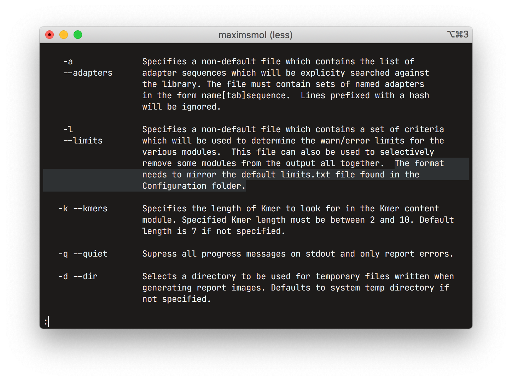
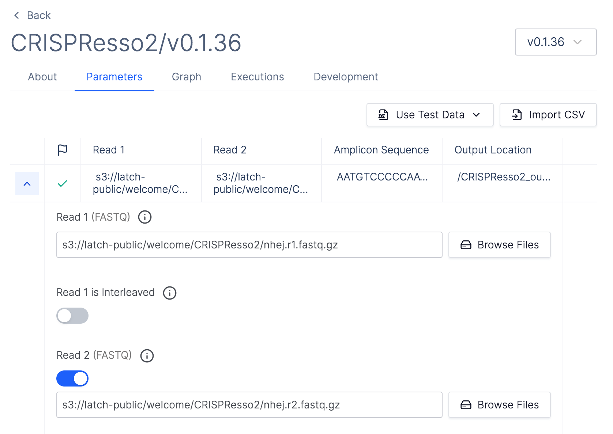
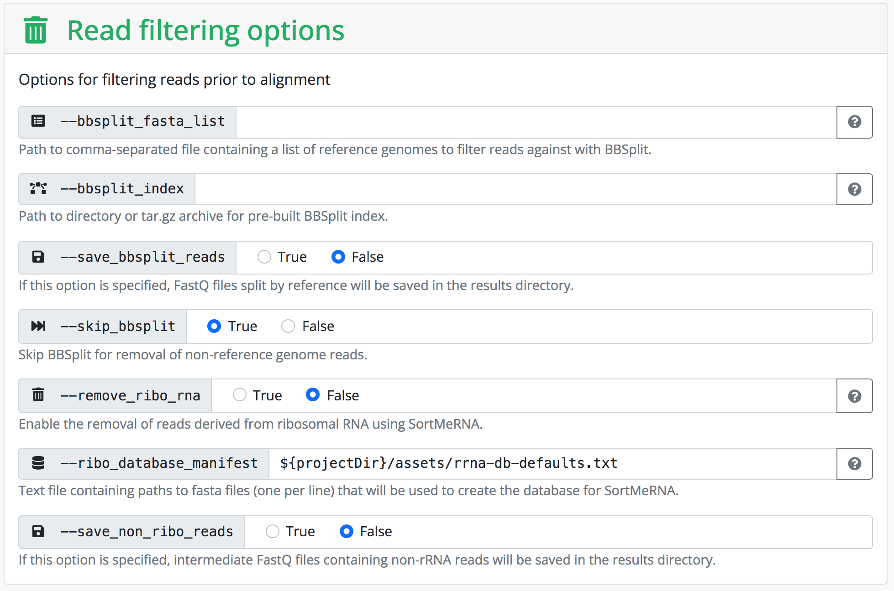
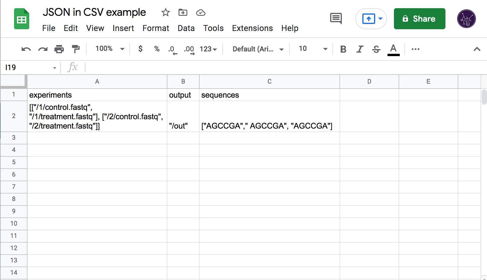
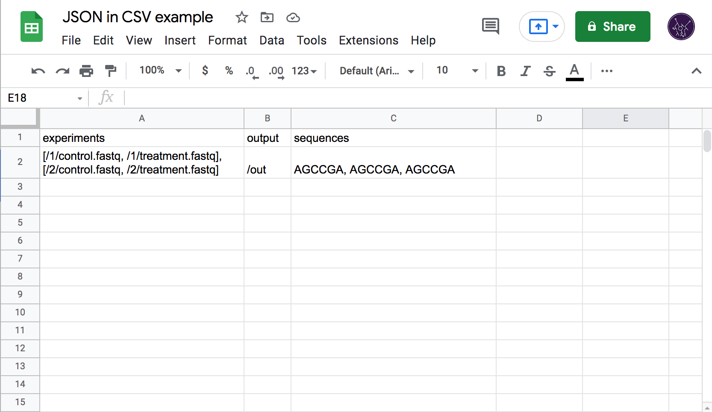

# Structured CSV

## Quick Links

- [SCSV Specification](https://github.com/latchbio/public-js/blob/main/packages/scsv-parser/specification.md)
- [SCSV NPM package](<todo(maximsmol)>)
- [Latch Bio](https://latch.bio)

## Typing Bioinformatics

Bioinformatics workflows frequently have dozens of different settings that need to be exposed to the experimenter. These parameters are usually consumed from the command line arguments in the form of text, coupled with ad hoc formatting rules for non-textual data. These representations are sometimes tedious to write, especially when using different tools each of which could, for example, use a different delimiter between list elements. It is also error-prone as workflows frequently do no upfront validation of the inputs, instead reporting an error and requiring a restart after a potentially large amount of work has already been finished.

Latch Console uses static typing information to get around these issues. We generate a form in a web interface that hides all the necessary formatting to serialize structured data into whatever format the underlying workflow can consume. This lets us abstract away the rules of each individual tool and present a standardized user experience. We also get some type validation for free as HTML inputs can be configured to only allow certain data e.g. only valid numbers.

This is in contrast with existing web UIs, such as the one built into [nf-core](https://nf-co.re/)'s website, that predominantly expose textual form inputs and leave the formatting of structured data (e.g. lists) to the user.

The type information is also used on the backend to verify types between intermediate steps of the pipeline (and to do the actual serialization for the bioinformatics workflow or library, as necessary). This is possible due to our choice of workflow orchestration engine—[Flyte](https://flyte.org/)—which is the only option out there with first-class static typing. Some more fine-grained types are used in the upcoming rule-based data validation that we are shipping on top of the built-in HTML input types in the coming weeks, allowing us to verify semantical constraints e.g. that nucleotide sequences only include valid symbols.

## Batched Runs

Just as unstructured text-based inputs are the de facto standard data format for running bioinformatics tools, plain CSV is the default format for storing, organizing, and exchanging large quantities of data. This is largely due to the wide availability and popularity of spreadsheet software such as Excel, and the ease with which CSVs can be edited in a text editor.

For a workflow tool like ours, the primary need for CSV support is batched runs—the ability to execute the same workflow multiple times on different but related data. For example, an experiment that uses a treatment on multiple samples would produce a set of data that needs to be analyzed in a batch, with both the inputs and outputs represented in a CSV table, each row corresponding to a sample.

The dominance of CSV combined with its simplicity presents a problem for Latch as we work with data that cannot be trivially represented by strings of plain text. In the first versions of the platform, we required end users to provide JSON-formatted data inside of each CSV cell, with quotes escaped according to [RFC-4180](https://datatracker.ietf.org/doc/html/rfc4180) (which Excel and others do by default when exporting). This, however, completely negates the ease of manual editing as formatting JSON by hand (especially with the double-escaped quotes) is a horrible experience and strongly attenuates the usefulness of spreadsheet tools as they have no JSON-editing capabilities. We saw a lot of user confusion related to incorrectly quoted strings, trailing commas, and incorrectly nested brackets.

To solve this issue, I designed a new data exchange format with the specific goal of embedding complex data structures in CSV files.

## Structured CSV Format

I started by simplifying some trivial cases in which JSON was falling short. For example, the string "hello world" was previously encoded as `"""hello world"""` (triple quotes due to CSV-escaping the quotes) and displayed as `"hello world"` in Excel. Since this case is absolutely unambiguous (it is not a valid number, list, boolean, etc.) we could drop the quotes and let the user simply type `hello world` (both in Excel and in CSV).

Note: from here on, assume that CSV-escaping is handled by Excel or some other tool, for example `hello, world` is an edge case since it must be written as `"hello, world"` in the final CSV, but this is already specified in [RFC-4180](https://datatracker.ietf.org/doc/html/rfc4180) and implemented in every decent CSV library and application and so deserves no further mention.

Ambiguous cases require some more thought. For example, should `1234` be parsed as a string "1234" or as a number 1,234? The key insight is that we can use the type information to make the decision. If the workflow expects a number, the answer is 1,234. If it expects a string, the answer is "1234". Otherwise, the input is erroneous. We lose the self-describing property of JSON, but gain in user experience and input validation.

This is enough to specify syntax for all but one type of our type system:

- None (more commonly known as singleton)
- Integer
- Float
- String
- Boolean
- List of X
- Map from string to X

The one type that needs special attention is the sum type. This is an extension that I have implemented for Flyte early on that allows us to get around the homogeneity restriction on Flyte lists and maps. It allows specifying an "or" combination of types, for example a value of type `Sum [Integer, Boolean]` could hold either a number (e.g. `1234`) or a boolean (e.g. `false`). A value of type `List (Sum [Integer, Booleaan])` could then hold `[1234, false]`.

This obviously creates more ambiguous cases. Taking the `1234` example above, do we parse it as 1,234 or as "1234"? If the type is `Sum [String, Integer]`, we cannot make a decision. In such cases I fallback to JSON syntax. The string interpretations always has lowest priority (is only used when nothing else fits) unless it is explicitly quoted. So the answer is `1234` is parsed as 1,234 and the user can force "1234" by specifying `"1234"`. For ambiguous lists and maps I used the JSON delimiters (brackets and braces).

Because support for JSON delimiters for strings, lists, and dicts is already necessary to resolve ambiguities, SCSV also declares itself a superset of JSON (all valid JSON is valid SCSV for some type).

[Full specification of the SCSV format is available here.](https://github.com/latchbio/public-js/blob/main/packages/scsv-parser/specification.md)

## Implementation

### General Structure

Since parameter values are not extremely long, I used an in-memory backtracking recursive descent parser. I start with a top-level value parser that examines the expected type and calls a more specific routine. In most cases this is a primitive parser (e.g. string or integer parser). When a sum type is expected, the parser tries each option one at a time and resolves ambiguous parses according to a priority list which places strings last and determines which of the no-input interpretations is appropriate (we allow no input at all to mean none, empty string, or empty list). The list and map parsers recurse into the value parser.

### Backtracking

The parser saves a state struct—index into the data buffer, column number, line number, diagnostics array—and can return to it if requested. These structs serve as the backtracking checkpoints.

### Diagnostics

The parser can emit an error message at any time, which is a string annotated by the data buffer index, column number, and the line number. The specification lists which diagnostics are expected of compliant implementations.

### Float parsing

[Floating point numbers are extremely difficult to parse without loss of precision](https://stackoverflow.com/questions/85223/how-to-manually-parse-a-floating-point-number-from-a-string) because of rounding modes, denormals, and signed zeros. The current version of the parser simply recognizes the input and then feeds it to `Number.parseFloat`. I might implement an `ArrayBuffer`-based algorithm to construct the float bit-by-bit in the future though it is very likely to be slower than the native implementation.

### Testing

[The published NPM module](<todo(maximsmol)>) extensively uses [property-based testing](https://github.com/dubzzz/fast-check) to validate each part of the parser and has a set of unit tests from the SCSV specification draft.

In the future I would like to also use the entirety of [JSON test suite](https://github.com/nst/JSONTestSuite) to validate compatibility with JSON.

### Licensing

The code for the public NPM module is distributed under four licenses (choice of specific license left up to the consumer):

- MIT
- CC0
- BSD0
- UNLICENSE

This will hopefully allow as many people as possible to use the code with no restrictions and get it as close to public domain as feasible. Some instructions on choosing on of these licenses are in the README.
